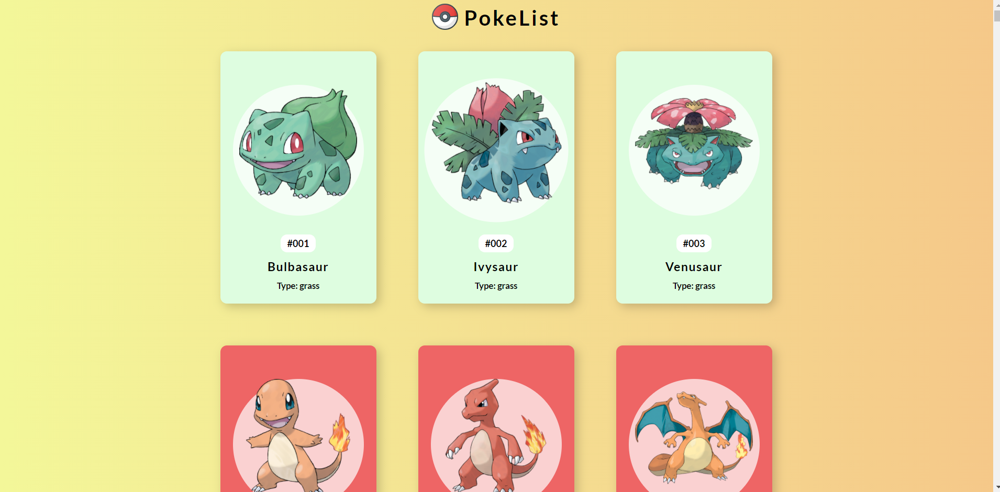
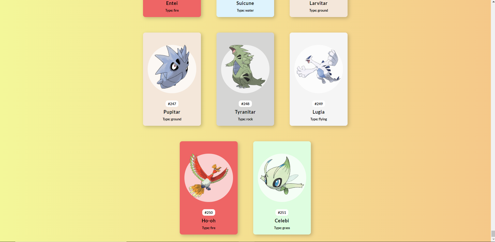
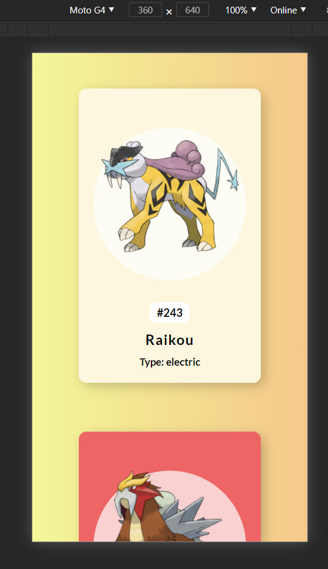

  <h1>
    
  </h1>

# Projeto Pokelist:

A PokeList é um projeto inicial feito com HTML5, CSS3 E JavaScript, que lista os 251 Pokemons das duas primeiras versões do jogo.

Minha intenção foi criar esse projeto a fim de treinar minhas habilidades em JavaScript. Esse foi o primeiro projeto em que consumi uma API com JS, para este caso, utilizei a  <a href="https://pokeapi.co/" target="_blank"> PokeAPI </a> .

Por meio deste, pude entender um pouco mais a respeito de funções assincrônas, promises e fetch. Bem como, trabalhar com interatividade entre vetores e ainda estilizar os pokemons com base em critérios encontrados em suas características disponibilizadas pela PokeAPI (por exemplo: as cores de cada pokemon mudam de acordo com o seu 'type')

## Intenções futuras:

Minha intenção é utilizar essa listagem de pokemons, para criar uma verdadeira PokeDex, em que o usuário consiga pesquisar e filtrar os pokemons de acordo com seus nomes, id e categoria. 

Outra funcionalidade que pretendo colocar, quando tiver tempo, é implementar os stats de cada um dos pokemons e poder criar um gráfico representativo de suas habilidades. Algo próximo do que podemos ver na <a href="https://www.pokemon.com/br/pokedex/" target="_blank"> Pokedex </a> oficial do Pokemon.

# Desenvolvimento
<ul>
<li>HTML 5</li>
<li>CSS 3</li>
<li>JavaScript</li>
</ul>

# Resultado

  
  
  
 

# Referências
Esse projeto foi inspirado no projeto de <a href="https://github.com/florinpop17" target="_blank"> Florin Pop</a>.
# Autor
<strong>Esse projeto foi desenvolvido por:</strong>
<h1>
  
Milton Soares
</h1>
